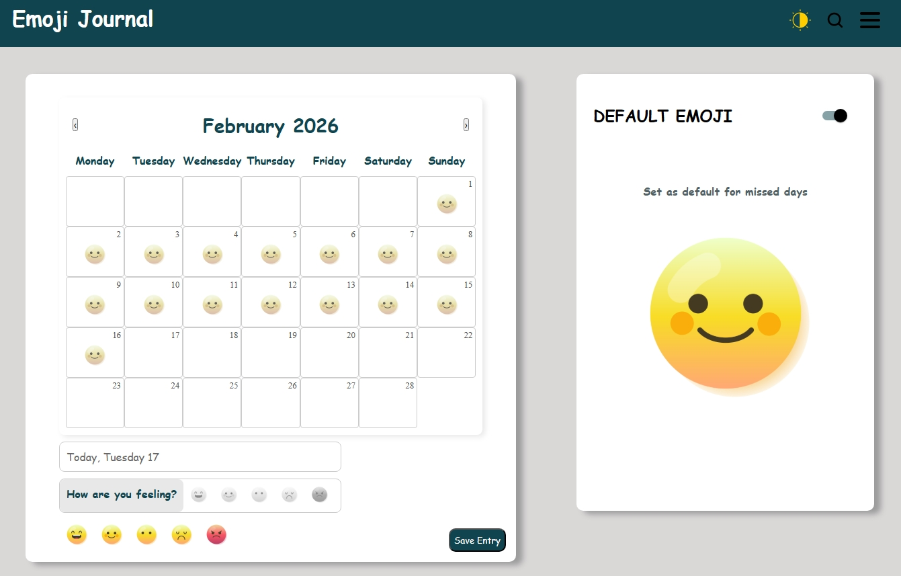
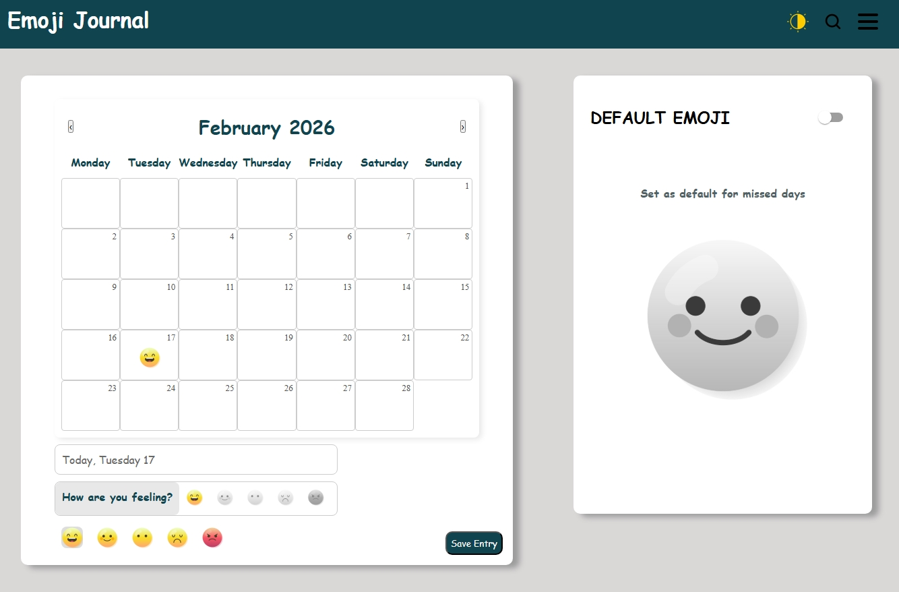

# Emoji Tracker App

A full-stack Emoji Tracker application built with **Django REST Framework** (backend) and **React + Vite** (frontend). Users can log daily moods via emojis, with a configurable default-emoji system that auto-fills missed days. The application demonstrates full-stack responsibilities, including API design, database modeling, frontend state management, and handling edge cases for a robust user experience.





---

## Quick Facts

- React development server: `http://localhost:5173`
- Django development server: `http://127.0.0.1:8000`
- Full-stack responsibilities handled: backend APIs, upsert logic, frontend state, CORS, environment management, and zero-state / error handling

---

## Folder Structure (Important parts)
```
root/
  backend/               # Django project (manage.py here)
    .env.example         # environment variables
    requirements.txt     # pip dependencies
    manage.py
  frontend/              # React app
    package.json
    src/
      api/
        api.js           # Axios API calls
      components/
        Tracker/         # Emoji logging interface
        DefaultEmoji/    # Default emoji toggle and state handling
        Navbar/
      App.jsx
      App.css
```
---

## Local Setup

### Backend

1. Create and activate a virtual environment:

```bash
python -m venv .venv
# Windows
.venv\Scripts\activate
# macOS/Linux
source .venv/bin/activate
```
2. Install dependencies:
```bash
pip install -r backend/requirements.txt
```
3. Apply migrations and run the server:
```bash
cd backend
python manage.py migrate
python manage.py runserver 127.0.0.1:8000
```
4. Confirm the API is working:
```bash
http://127.0.0.1:8000/api/emojis/
```
## Seed Data (Development)
Seed emoji entries for the last 30 days using a custom Django management command:
```bash
python manage.py seed_30_days_emojis
```
Reset the database and reseed:
```bash
rm db.sqlite3
python manage.py migrate
python manage.py seed_emojis
```
### Note:
Keeping seed commands under management/commands ensures reproducibility for other developers and avoids manual DB manipulation.

## Frontend
1. Install dependencies
```bash
   cd frontend
   npm install
```
2. Run the development server:
```bash
npm run dev
```
3. Open the app in the browser:
```bash
http://localhost:5173/
```

## Technical Highlights
- **Upsert Logic:** Customized DRF create behavior to update existing emoji entries or create new ones, ensuring idempotent API behavior.
- **Resilient Frontend:** UI renders independently of server availability; if the API fails, the interface still loads and displays a clear message without breaking functionality.
- **Single Source of Truth:** Backend data fetched once, normalized, and rendered consistently across the app.
- **Zero-State & Boundary Conditions:** Handles scenarios for new users, missing data, and default-emoji logic to avoid empty or broken interfaces.
- **Environment & Security:** Configured environment variables for secure API keys and development settings.
